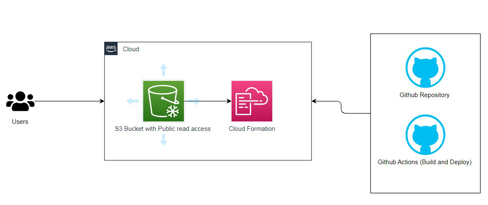

# AWS Cloud Resume Challenge

## Overview

The AWS Cloud Resume Challenge is a project aimed at showcasing proficiency in cloud computing and DevOps practices by deploying a personal resume website on AWS infrastructure. This README provides an overview of the project architecture.

## Architecture Diagram

## Components

### 1. Static Website Hosting

The resume website is hosted on AWS S3 (Simple Storage Service), providing scalable and cost-effective storage for static web content. S3 is configured to serve the HTML, CSS, and JavaScript files of the resume website to users.

### 2. Infrastructure Automation

AWS CloudFormation is used to automate the provisioning of AWS resources required for hosting the resume website. A CloudFormation template defines the S3 bucket, IAM roles, and any other necessary infrastructure components.

### 3. Continuous Integration/Continuous Deployment (CI/CD)

GitHub Actions is utilized for implementing a CI/CD pipeline. On each commit to the main branch of the GitHub repository, GitHub Actions automatically builds the website assets and deploys them to the S3 bucket, ensuring rapid and reliable updates to the website.

### 4. Version Control

The project source code, including HTML, CSS, JavaScript files, and CloudFormation templates, is managed using Git version control and stored in a GitHub repository. This enables collaboration, version tracking, and code review.

## How to Use

To deploy your resume website using this project:

1. Clone this GitHub repository to your local machine.
2. Customize the HTML, CSS, and JavaScript files in the `website` directory with your resume content and styling preferences.
3. Modify the CloudFormation template (`cloudformation.yaml`) if necessary to adjust AWS resource configurations.
4. Commit your changes to the main branch of the repository.
5. GitHub Actions will automatically trigger a build and deployment process, updating the resume website hosted on AWS S3.

## Contributors

- [Your Name](https://github.com/BalamuruganS-Data)

## License

This project is licensed under the [MIT License](LICENSE).
